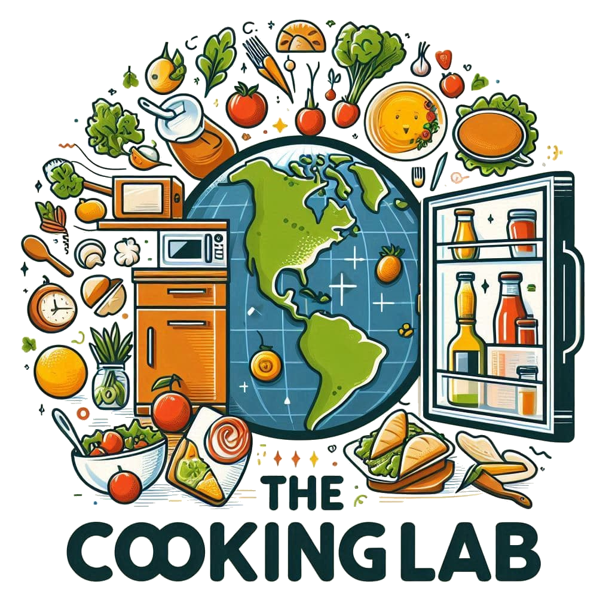

# `r params$nom`

```{r, echo=FALSE, fig.align='center', out.width="70%"}
knitr::include_graphics(params$image_path)
```

- **Régime alimentaire** : `r params$regime`
- **Temps de préparation** : `r params$prep_time` min
- **Temps de cuisson** : `r params$cook_time` min

## Ingrédients
`r params$ingredients`

## Instructions
`r params$instructions`

---

Crédits : **The Cooking Lab**

```{r, echo=FALSE, fig.align='center', out.width="20%"}

```

